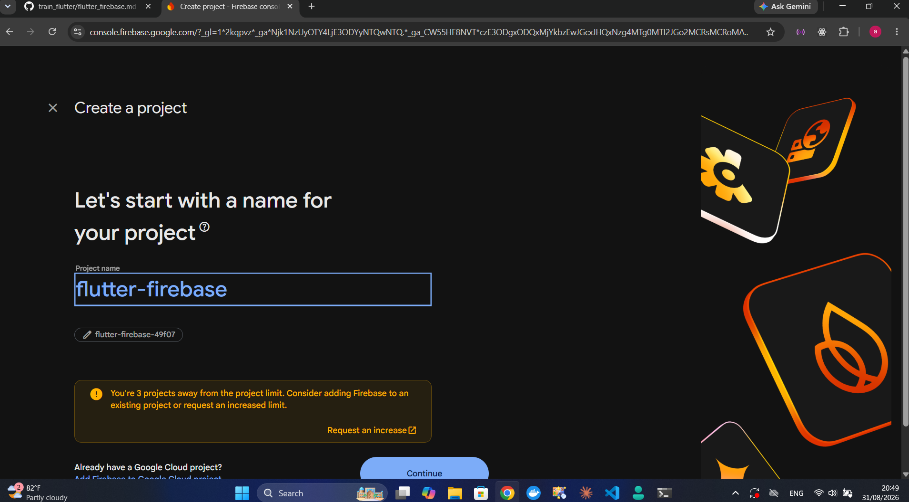
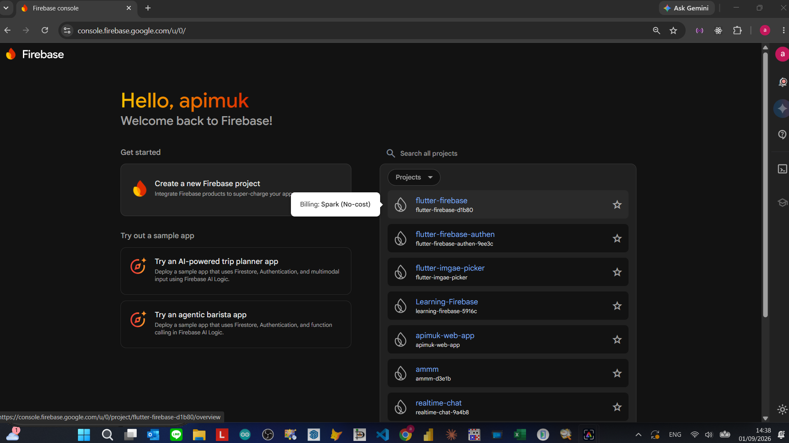

# flutter_firebase

ในที่นี้จะจัดเก็บโปรเจคไว้ในโฟลเดอร์เดียวกันกับไฟล์ flutter_firebase.md
นั่นคือโฟล์เดอร์ train_flutter

1. เข้าไปในโฟล์เดอร์ train_flutter ที่ address bar พิมพ์ code . 
  เพื่อเรียก VScode ให้มาทำงานในโฟล์เดอร์นี้

  - กด Ctrl+Shift+P เลือก Flutter:Create New Project เพื่อสร้างโปรเจค
  - เลือก Application 
  - เลือกโฟล์เดอร์ที่จะจัดเก็บโปรเจ็ค
  - ตั้งชื่อโปรเจ็ค ในที่นี้ตั้งชื่อ flutter_firebase 

Flutter จะทำการสร้างโปรเจ็คให้

2. คลิ๊กที่lib เลือกไฟล์ main.dart แล้วแต่งเป็น

```dart

import 'package:flutter/material.dart';
void main() => runApp(const MyApp());
class MyApp extends StatelessWidget {
  const MyApp({super.key});
  @override
  Widget build(BuildContext context) =>
      MaterialApp(   
        debugShowCheckedModeBanner: false,
        theme: ThemeData(
          colorScheme: ColorScheme.fromSeed(seedColor: Colors.deepPurple),
        ),
        home: Container(
          decoration: BoxDecoration(
            gradient: LinearGradient(
              begin: Alignment.topLeft,
              end: Alignment.bottomRight,
              colors: [
              Colors.deepPurple.shade900,
              Colors.purpleAccent,
              Colors.deepPurple.shade900,
            ])
          ),
          child: Placeholder(),
        ),
      );   
}

```

3. กด Ctrl+Shift+P >  Select device เพื่อเลือก Divice เพื่อเลือกอุปกรณ์ที่จะรัน
  แลัวกด F5 เพื่อรันแอพในอุปกรณ์ที่เลือก

4. สร้างโฟลเดอร์เก็บรูป ในระดับเดียวกับ lib ดังนี้ assets/images/
  - คลิ๊กพื้นที่ว่างล่างสุด
  - สร้างโฟลเดอร์ assets
  - ในโฟล์เดอร์ assets สร้างโฟล์เดอร์ images 
  - นำไฟล์ logo.png มาเก็บในโฟล์เดอร์
  - ที่ `pubspec.yaml` เพิ่ม,พิมพ์และอินเดนท์ให้ถูก

  ```yaml
  
  assets:
    - assets/images/
  
  ```  

5. สร้างโฟลเดอร์ screens ในโฟล์เดอร์ lib ไว้เก็บหน้าจอต่างๆ 

  
6. สร้าง homescreen.dart ในโฟล์เดอร์ screens และแต่ง

```dart

import 'package:flutter/material.dart';
class HomeScreen extends StatelessWidget {
  const HomeScreen({super.key});
  @override
  Widget build(BuildContext context) => 
  Scaffold(
    backgroundColor: Colors.black.withValues(alpha: 0.0), // ทำให้พื้นหลังของ Scaffold โปร่งใส
    body: Padding(
      padding: const EdgeInsets.all(18.0),
      child: Column(
        mainAxisAlignment: MainAxisAlignment.center,
        children: [
          Container(
            clipBehavior: Clip.antiAlias, // เพิ่มบรรทัดการตัดขอบให้กับ Container
            decoration: BoxDecoration(
              borderRadius: BorderRadius.circular(20),
              color: Colors.red,
            ),
            child:         Image.asset(
              'assets/images/logo.png',
              fit: BoxFit.cover,
            )
          ),
          SizedBox(height: 50,),
          SizedBox(
            width: double.infinity,
            height: 50,
            child: TextButton.icon(
              style: TextButton.styleFrom(                
                backgroundColor: const Color.fromARGB(255, 93, 10, 245),
                foregroundColor: Colors.white,
                shape: RoundedRectangleBorder(
                  borderRadius: BorderRadius.all(
                    Radius.circular(10),
                  ),
                ),
              ),
              icon: const Icon(Icons.person_add_alt_1_outlined, size: 30,),
              label: const Text("สร้างบัญชีผู้ใช้", style: TextStyle(fontSize: 20,fontStyle: FontStyle.italic),),
              onPressed: (){
                
              }
          ),
          ),
          SizedBox(height: 10,),
          SizedBox(
            width: double.infinity,
            height: 50,
            child: TextButton.icon(
              style: TextButton.styleFrom(                
                backgroundColor: const Color.fromARGB(255, 93, 10, 245),
                foregroundColor: Colors.white,
                shape: RoundedRectangleBorder(
                  borderRadius: BorderRadius.all(
                    Radius.circular(10),
                  ),
                ),
              ),
              icon: const Icon(Icons.login_outlined, size: 30,),
              label: const Text("เข้าสู่ระบบ",style: TextStyle(fontSize: 20, fontStyle: FontStyle.italic),),
              onPressed: (){
                
              }
            ),
          ),           
      ],),
    )
  );
}

```

- ที่ main.dart 

7. สร้าง registerscreen.dart 

```dart

import 'package:flutter/material.dart';
class RegisterScreen extends StatefulWidget {
  const RegisterScreen({super.key});
  @override
  State<RegisterScreen> createState() => _RegisterScreenState();
}
class _RegisterScreenState extends State<RegisterScreen> {
  @override
  Widget build(BuildContext context) {
    return Container(
      decoration: const BoxDecoration(
        gradient: LinearGradient(
          colors: [Colors.deepPurple, Colors.purple],
          begin: Alignment.topCenter,
          end: Alignment.bottomCenter,
        ),
      ),
      child: Scaffold(
        // Scaffold มีพื้นเป็นสีดำ
        backgroundColor: Colors.black.withValues(alpha: 0.0), // ทำให้พื้นหลังของ body Scaffold โปร่งใส        
        body: Padding(
          padding: const EdgeInsets.all(18.0),
          child: Center(
            child: Container(
              width: double.infinity,
              height: 400,
              decoration: BoxDecoration(
                borderRadius: BorderRadius.circular(20),
                color: Colors.white,
              ),
              child: Form(
                child: Padding(
                  padding: const EdgeInsets.only(left: 20, right: 20,),
                  child: Column(
                    mainAxisAlignment: MainAxisAlignment.center,
                    crossAxisAlignment: CrossAxisAlignment.start,
                  
                    children: [
                      Text("อีเมล์", style: TextStyle(fontSize: 20)),
                      TextFormField(),
                      SizedBox(height: 15),
                      Text("รหัสผ่าน", style: TextStyle(fontSize: 20)),
                      TextFormField(),
                      SizedBox(height: 15),
                      SizedBox(
                        width: double.infinity,
                        height: 50,
                        child: TextButton.icon(
                          style: TextButton.styleFrom(
                            backgroundColor: const Color.fromARGB(255, 93, 10, 245),
                            foregroundColor: Colors.white,
                            shape: RoundedRectangleBorder(
                              borderRadius: BorderRadius.zero,
                            ),
                          ),
                          icon: const Icon(Icons.person_add_alt_1_outlined, size: 30,),
                          label: const Text(
                            "สร้างบัญชีผู้ใช้",
                            style: TextStyle(
                              fontSize: 20,
                              fontStyle: FontStyle.italic,
                            ),
                          ),
                          onPressed: () {
                            
                          },
                        ),
                      ),
                      SizedBox(height: 15),
                      SizedBox(
                        width: double.infinity,
                        height: 50,
                        child: TextButton.icon(
                          style: TextButton.styleFrom(
                            backgroundColor: const Color.fromARGB(255, 93, 10, 245),
                            foregroundColor: Colors.white,
                            shape: RoundedRectangleBorder(
                              borderRadius: BorderRadius.zero,
                            ),
                          ),
                          icon: const Icon(Icons.arrow_back, size: 30,),
                          label: const Text(
                            "กลับหน้าหลัก",
                            style: TextStyle(
                              fontSize: 20,
                              fontStyle: FontStyle.italic,
                            ),
                          ),
                          onPressed: () {
                            Navigator.pop(context);
                          },
                        ),
                      ),
                    ],
                  ),
                ),
              ),
            ),
          ),
        ),
      ),
    );
  }
}


```

8. สร้าง action ให้กับปุ่ม Register ใน homescreen.dart

```dart
Navigator.push(
  context,
  MaterialPageRoute(builder: (ctx) => RegisterScreen()),
);
```

9. ก็อบและแก้ loginscreen.dart และแก้ชื่อคลาส LoginScreen

10. สร้าง action ให้กับปุ่ม Login ใน homescreen.dart

```dart
Navigator.push(
  context,
  MaterialPageRoute(builder: (ctx) => LoginScreen()),
);
```

11. ทดลองคลิกเลื่อนไปมาแต่ละหน้า

12. หน้าจอ RegisterScreen    

    - เก็บการเปลี่ยนสเตทของฟอร์มแบบโกลบอล และให้คีย์ของฟอร์มคือสเตทที่เก็บ

```dart
class _RegisterScreenState extends State<RegisterScreen> {
final formkey = GlobalKey<FormState>();

Form(
  key: formkey,
  // ...
)

}
```

    - แต่ง TextFormField() เพื่อการตรวจสอบ เช่น

```dart
keyboardType: TextInputType.emailAddress,
obscureText: true,
```

13. สร้าง Data Model

    - Model
      - datamodel.dart

```dart
class Profile {
  String email;
  String password;

  Profile({
  required this.email,
  required this.password,
  });
}
```

14. ใช้ datamodel

    - ที่ RegisterScreen เรียกใช้คลาส Profile เพื่อใช้เก็บข้อมูล

```dart
class _RegisterScreenState extends State<RegisterScreen> {
  // ...
  Profile profile = Profile(email: 'test@gmail.com',password: '123456',);
  // ...
}
```

    - เมื่อเกิดเหตุการณ์ onSaved เอาค่าที่กรอกไปใส่ใน profile

```dart
Text("อีเมล์", style: TextStyle(fontSize: 20)),
TextFormField(
  // ...
  onSaved: (e) {
    profile.email = e!;
  },
),
```

```dart
Text("รหัสผ่าน", style: TextStyle(fontSize: 20)),
TextFormField(
  // ...
  onSaved: (e) {
    profile.password = e!;
  },
),
```

    - ที่ปุ่ม TextButton.icon หากมีการกดปุ่มแล้ว ถ้า validate ผ่าน ให้ currentState มีสถานะเป็น save แล้ว...

```dart
onPressed: () {
  if (formkey.currentState!.validate()) {
    // มีเครื่องหมาย ! ด้านหลังเพื่อบอก dart ว่า currentState ไม่ใช่ null แน่นอน
    formkey.currentState!.save();
    print("email = ${profile.email} : password = ${profile.password}");
    formkey.currentState!.reset(); // เคลียร์ค่า
  }
},
```

15. ติดตั้ง form_field_validator: ^1.1.0

```yaml
dependencies:
  flutter:
    sdk: flutter
  cupertino_icons: ^1.0.8
  form_field_validator: ^1.1.0
```

    - ทำการ Validate ที่แต่ละ TextFormField

```dart
class _RegisterScreenState extends State<RegisterScreen> {
  // ...

  final emailValidator = MultiValidator([
    RequiredValidator(errorText: 'คุณไม่ได้กรอก Email'),
    EmailValidator(errorText: "รูปแบบ Email ผิด"),
  ]);

  final passwordValidator = MultiValidator([
    RequiredValidator(errorText: 'คุณไม่ได้กรอก Email password '),
    MinLengthValidator(8, errorText: 'password ต้องมีอย่างน้อย 8 อักขระ'),
    PatternValidator(r'(?=.*?[#?!@$%^&*-])',
        errorText: 'passwords ต้องมีอย่างน้อย 1 อักขระพิเศษ'),
  ]);

  // ...
}
```

```dart
Text("อีเมล์", style: TextStyle(fontSize: 20)),
TextFormField(
  keyboardType: TextInputType.emailAddress,
  onSaved: (e) {
    profile.email = e!;
  },
  validator: emailValidator.call,
),
```

```dart
Text("รหัสผ่าน", style: TextStyle(fontSize: 20)),
TextFormField(
  obscureText: true,
  onSaved: (e) {
    profile.password = e;
  },
  validator: passwordValidator.call,
),
```

`validator:` ต้องการ **ฟังก์ชัน** แต่ `emailValidator` เป็น **object** (MultiValidator) ที่มีเมธอด `call` อยู่ วิธีแก้คือบอก Dart ให้ชัดว่าจะใช้เมธอด `call` โดยเติม `.call` ต่อท้าย object


16. สร้างโปรเจ็ค Firebase 
  

  

  

  

  
17. ติดตั้ง Firebase Core ใน pubspec.yml
 
```yaml
dependencies:
  flutter:
    sdk: flutter
  cupertino_icons: ^1.0.8
  form_field_validator: ^1.1.0
  firebase_core: ^4.14.0
```
18. เชื่อมแอพกับ Firebase

  - ที่ Firebase Project คลิ๊ก +Add app
  - เลือก Android 

  1. Register app  
    
    - เปิด android\app\build.gradle.kts 
    - ที่บรรทัดที่ 8 namespace = "com.example.flutter_firebase_authen" ก็อบค่าไปวางที่ Android package name ใน Firebase แล้วตั้งชื่อเล่นของแอพเรา ในที่นี้ตั้งเป็น flutter-firebase
    - กด Register app 

  2. Download and then add config file

    - Download google-services.json แล้ว Unzip
    - ลากไฟล์ google-services.json ไปวางในตำแหน่ง android\app\google-services.json

  3. Add Firebase SDK

    1. — root-level build.gradle.kts
        - เปิดไฟล์ android/build.gradle.kts (ตัวที่อยู่ root ของโฟลเดอร์ android)
          Flutter รุ่นใหม่ที่ไม่มี plugins { } block มาให้ตั้งแต่ต้น 
          ให้เพิ่ม plugins { } ไว้ส่วนบนสุดเลย

        ```kolin

          plugins {
            id("com.google.gms.google-services") version "4.5.0" apply false
          }

        ```

    2. — module (app) level build.gradle.kts
        - เปิดไฟล์ android/app/build.gradle.kts แล้วเพิ่ม plugin id ใน block plugins { }

        ```kolin

            plugins {
              //..
              id("com.google.gms.google-services")
            }

        ```
        ส่วน dependencies { } ที่หน้าจอบอกให้ใส่ Firebase BoM/analytics ตรงนั้น ข้ามได้เลย ถ้าเป็นโปรเจกต์ Flutter — เพราะแพ็กเกจ firebase_core, firebase_auth ฯลฯ ที่คุณ flutter pub add ไว้ใน pubspec.yaml จะจัดการดึง native dependency ให้เองอยู่แล้ว ไม่ต้องมาประกาศซ้ำใน build.gradle.kts ของ app

    3. sync
        - สำหรับ Flutter ไม่ต้องกด "Sync" ใน Android Studio ก็ได้ แค่รัน flutter clean แล้ว flutter pub get จากนั้น flutter run ตัว Gradle จะ sync ให้เองตอน build
      
  4. Newt --> Continue to console

    ลองรัน Flutter หากไม่มีเออเรอร์อะไรแปลว่าเชื่อมต่อได้แล้ว

19. ใช้ Future Builder เชื่อมต่อ

    - ที่ registerscreen.dart ให้เพิ่ม 

    ```dart

    class _RegisterScreenState extends State<RegisterScreen> {
      //...
      Profile profile = Profile(email: 'test@gmail.com',password: '123456',);
      final Future<FirebaseApp> firebase = Firebase.initializeApp(); 

    }

    ```

    - comment Scaffold แล้วใช้ FutureBuilder แทน

    ```dart
  
      @override
      Widget build(BuildContext context) => FutureBuilder(
        future: firebase,
        builder: (context, snapshot) {
          
        },
      );

    ```

    - ทดสอบการเชื่อมต่อ

    ```dart
  
      @override
      Widget build(BuildContext context) => FutureBuilder(
        future: firebase,
        builder: (context, snapshot) {
            if (snapshot.hasError) {
              return Scaffold(body: Center(child: Text("${snapshot.error}")),);
            }
            return const Scaffold(body: Center(child: CircularProgressIndicator()),);
        },
      );

    ```

    เนื่องจาก builder ต้องคืนค่ามาเป็น Widget เสมอ ดังนั้นต้องเขียน Widget ดักไว้ทั้งสองทาง

    - แทรกการตรวจสอบเมื่อเชื่อมต่อสำเร็จ

    ```dart
  
      @override
      Widget build(BuildContext context) => FutureBuilder(
        future: firebase,
        builder: (context, snapshot) {
            if (snapshot.hasError) {
              return Scaffold(body: Center(child: Text("${snapshot.error}")),)
            }
            if(snapshot.connectionState == ConnectionState.done){
              return  //... เอา Scaffold ที่เคยคอมเมนท์ไว้มาใส่ในนี้
              Scaffold(
                appBar: AppBar(title: Text("Apimuk"),),
                body: Center(child: Text("เชื่อมต่อสำเร็จ")),
              );    
            }
            return const Scaffold(body: Center(child: CircularProgressIndicator()),);
            
        },
      );

    ```

    - เอา Scaffold ที่เคยคอมเมนท์ไว้มาใส่

      
    ```dart
  
      @override
      Widget build(BuildContext context) => FutureBuilder(
        future: firebase,
        builder: (context, snapshot) {
            if (snapshot.hasError) {
              return Scaffold(body: Center(child: Text("${snapshot.error}")),)
            }
            if(snapshot.connectionState == ConnectionState.done){
              return  //... เอา Scaffold ที่เคยคอมเมนท์ไว้มาใส่ในนี้
                 
            }
            return const Scaffold(body: Center(child: CircularProgressIndicator()),);
            
        },
      );

    ```

20. ติดตั้ง Firebase Auth

  - pub.dev ค้นหา Firebase Auth

  - เพิ่ม dependencies

  ```yaml
  dependencies:
    flutter:
      sdk: flutter
    cupertino_icons: ^1.0.8
    form_field_validator: ^1.1.0
    firebase_core: ^4.14.0
    firebase_auth: ^6.6.0
  ```

21. สร้างบัญชีผู้ใช้

  - ไปที่โปรเจ็ค เลือก Security>Authentication>GetStart

  - Sign-in method เลือก Email/Password 

  - ทำการ enable Email/Password แล้ว save

  - กลับไปที่แท็ป Users เพื่อดูรายการ User

  - ไปที่ Action ของปุ่ม Register แล้วเรียกใช้ Instance สร้าง user ของ FirebaseAuthen แทนคำสั่ง print 

  ```dart

  onPressed: () {
    if (formkey.currentState!.validate()) {
      // มีเครื่องหมาย ! ด้านหลังเพื่อบอก dart ว่า currentState ไม่ใช่ null แน่นอน
      formkey.currentState!.save();
      // print("email = ${profile.email} : password = ${profile.password}");
      FirebaseAuth.instance
        .createUserWithEmailAndPassword(
          email: profile.email,
          password: profile.password,
      );
      formkey.currentState!.reset();
    }
  },
  
  ```


  - ตรวจจับ error ด้วย try{}catch{} FirebaseAuth แล้วลองใส่ email ซ้ำ 

  ```dart

  onPressed: () {
    if (formkey.currentState!.validate()) {
      // มีเครื่องหมาย ! ด้านหลังเพื่อบอก dart ว่า currentState ไม่ใช่ null แน่นอน
      formkey.currentState!.save();
      // print("email = ${profile.email} : password = ${profile.password}");
       try {
          FirebaseAuth.instance
            .createUserWithEmailAndPassword(
              email: profile.email,
              password: profile.password,
            );
        } on FirebaseAuthException catch (e) {
          print(e.message);
        }
      formkey.currentState!.reset();
    }
  },
  
  ```

    จะเกิด error <asynchronous suspension> ให้ใส่ asynce await


  ```dart

  onPressed: () asynce {      // บอกว่าในนี้มีกสนทำงานแบบ asynce
    if (formkey.currentState!.validate()) {
      // มีเครื่องหมาย ! ด้านหลังเพื่อบอก dart ว่า currentState ไม่ใช่ null แน่นอน
      formkey.currentState!.save();
       print("email = ${profile.email} : password = ${profile.password}");
       try {                                    // เมื่อเข้า try
          await FirebaseAuth.instance           // ให้รอสรัางบัญชีเสร็จก่อน
            .createUserWithEmailAndPassword(
              email: profile.email,
              password: profile.password,
            );
          print("สร้างบัญชีผู้ใช้เรียบร้อยแล้ว");        // แล้วปรินต์          
        } on FirebaseAuthException catch (e) {
          print(e.message);
        }
      formkey.currentState!.reset();
    }
  },
  
  ```
  ลองสร้างแอ็คเคาท์ซำ้จะได้ 
  ค่าที่ปรินต์ออกมาเป็น The email address is already in use by another account.

22. แจ้งสถานะผ่าน Toast / cherry taost

  - ติดตั้ง fluttertoast
  - เพิ่ม dependencies

  ```yaml
  dependencies:
    flutter:
      sdk: flutter
    cupertino_icons: ^1.0.8
    form_field_validator: ^1.1.0
    firebase_core: ^4.14.0
    firebase_auth: ^6.6.0
    fluttertoast: ^10.0.0

  ```

  - เรียกใช้ fluttertoast

  ```dart

  onPressed: () async {
    if (formkey.currentState!.validate()) {
    // มีเครื่องหมาย ! ด้านหลังเพื่อบอก dart ว่า currentState ไม่ใช่ null แน่นอน
      formkey.currentState!.save();
      print("email = ${profile.email} : password = ${profile.password}",);
      try {
        await FirebaseAuth.instance
        .createUserWithEmailAndPassword(
          email: profile.email,
          password: profile.password,
        );
        print("สร้างบัญชีผู้ใช้เรียบร้อยแล้ว");
        Fluttertoast.showToast(
          msg: "สร้างบัญชีผู้ใช้เรียบร้อยแล้ว",
          gravity: ToastGravity.CENTER
        );
        } on FirebaseAuthException catch (e) {
          print(e.message);
          Fluttertoast.showToast(
            msg: e.message ?? "เกิดข้อผิดพลาด",
            gravity: ToastGravity.CENTER
          );
        }
        formkey.currentState!.reset(); // เคลียร์ค่า
      }
    },
  
  ```
 
  - ปรับแต่งค่า  message โดยก็อบค่า e.code ที่ Debug Console มาเป็นตัวเทียบ


  ```dart

  onPressed: () async {
                                if (formkey.currentState!.validate()) {
                                  // มีเครื่องหมาย ! ด้านหลังเพื่อบอก dart ว่า currentState ไม่ใช่ null แน่นอน
                                  formkey.currentState!.save();
                                  print(
                                    "email = ${profile.email} : password = ${profile.password}",
                                  );
                                  try {
                                    await FirebaseAuth.instance
                                        .createUserWithEmailAndPassword(
                                          email: profile.email,
                                          password: profile.password,
                                        );
                                    print("สร้างบัญชีผู้ใช้เรียบร้อยแล้ว");
                                    Fluttertoast.showToast(
                                      msg: "สร้างบัญชีผู้ใช้เรียบร้อยแล้ว",
                                      gravity: ToastGravity.CENTER
                                    );
                                  } on FirebaseAuthException catch (e) {
                                      print(e.code);
                                      String message;
                                      if (e.code == "email-already-in-use") {
                                        message = "มีการใช้งานเมล์นี้แล้ว";
                                      }else if(e.code == "weak-password") {
                                        message = "รหัสผ่านต้อง 6 ตัวขึ้น";
                                      }else {
                                         message = e.message!;
                                      }
                                    Fluttertoast.showToast(
                                      msg: message,
                                      gravity: ToastGravity.CENTER
                                    );
                                  }
                                  formkey.currentState!.reset(); // เคลียร์ค่า
                                }
                              },
  
  ```


23. เนื่องจาก FlutterTaost ไม่สวย ลองใช้ cherry taost

- ติดตั้ง fluttertoast
  - เพิ่ม dependencies

  ```yaml
  dependencies:
    flutter:
      sdk: flutter
    cupertino_icons: ^1.0.8
    form_field_validator: ^1.1.0
    firebase_core: ^4.14.0
    firebase_auth: ^6.6.0
    fluttertoast: ^10.0.0
    cherry_toast: ^1.13.0

  ```

 ```dart

onPressed: () async {
                                if (formkey.currentState!.validate()) {
                                  // มีเครื่องหมาย ! ด้านหลังเพื่อบอก dart ว่า currentState ไม่ใช่ null แน่นอน
                                  formkey.currentState!.save();
                                  print(
                                    "email = ${profile.email} : password = ${profile.password}",
                                  );
                                  try {
                                    await FirebaseAuth.instance
                                        .createUserWithEmailAndPassword(
                                          email: profile.email,
                                          password: profile.password,
                                        );
                                    print("สร้างบัญชีผู้ใช้เรียบร้อยแล้ว");
                                    // Fluttertoast.showToast(
                                    //   msg: "สร้างบัญชีผู้ใช้เรียบร้อยแล้ว",
                                    //   gravity: ToastGravity.CENTER
                                    // );
                                    CherryToast.success(
                                      title: const Text('สำเร็จ'),
                                      description: const Text('สร้างบัญชีผู้ใช้เรียบร้อยแล้ว'),
                                    ).show(context);
                                  } on FirebaseAuthException catch (e) {
                                      print(e.code);
                                      String message;
                                      if (e.code == "email-already-in-use") {
                                        message = "มีการใช้งานเมล์นี้แล้ว";
                                      }else if(e.code == "weak-password") {
                                        message = "รหัสผ่านต้อง 6 ตัวขึ้น";
                                      }else {
                                         message = e.message!;
                                      }
                                    // Fluttertoast.showToast(
                                    //   msg: message,
                                    //   gravity: ToastGravity.CENTER
                                    // );
                                    CherryToast.error(
                                      title: const Text('ผิดพลาด'),
                                      description: Text(message),
                                    ).show(context);
                                  }
                                  formkey.currentState!.reset(); // เคลียร์ค่า
                                }
                              },
```

  - อย่าลืมไปคอมเมนท์ import ... fluttertaost.dart เพราะจะมีเออเรอร์


24. ระบบ Login

  - ที่ loginscreen.dart ก็อบดีไซส์จาก registerscreen.dart มา
    ทั้ง import ต่างๆ และ โค้ดตั้งแต่ ...

  ```dart
    class _RegisterScreenState extends State<RegisterScreen> {
      // เอาทั้งหมดในนี้      
    }

  ```

  แล้วแก้

  - ชื่อคลาสทั้งหมดโดยดับเบิ้ลคลิ๊กที่ชื่อแล้วกด Ctrl+D เพื่อให้คลุมทั้งหมด

  - เปลี่ยน createUserWithEmailAndPassword ของ FirebaseAuth.instance
    เป้น signInWithEmailAndPassword

  ```dart

  FirebaseAuth.instance
  .signInWithEmailAndPassword(
    email: profile.email,
    password: profile.password,
  );

  ```


  - เมื่อล็อกอินสำเร็จให้เปลี่ยนหน้าไปหน้า Wellcome (wellcome.dart)
    
  ```dart

  await FirebaseAuth.instance
    .signInWithEmailAndPassword(
      email: profile.email,
      password: profile.password,
  );
  formkey.currentState!.reset(); // เคลียร์ค่า
  Navigator.pushReplacement(     // push จะเก็บหน้าเก่าไว้ใน Stack
    context,
    MaterialPageRoute(builder: (ctx) => Wellcome()),
  );


  ```

  - สำหรับ Login 

  ```dart

  on FirebaseAuthException catch (e) {
    print(e.code);
    String message;
    if (e.code == 'user-not-found') {
      message = 'ไม่พบผู้ใช้งานนี้';
    } else if (e.code == 'wrong-password') {
      message = 'รหัสผ่านไม่ถูกต้อง';
    } else if (e.code == 'invalid-credential') {
      message = 'Email หรือ Password ไม่ถูกต้อง';
    } else if (e.code == 'invalid-email') {
      message = 'รูปแบบ Email ไม่ถูกต้อง';
    } else {
      message = e.message ?? 'เกิดข้อผิดพลาด';
    }
    Fluttertoast.showToast(
      msg: message,
      gravity: ToastGravity.CENTER,
      );
  }


  ```

25. เอาข้อมูลที่ส่งกลับมา มาใช้งานใน Wellcome

```dart

    import 'package:flutter/material.dart';
import 'package:firebase_auth/firebase_auth.dart';

class Wellcome extends StatefulWidget {
  const Wellcome({super.key});

    @override
  State<Wellcome> createState() => _WellcomeState();
}

  class _WellcomeState extends State<Wellcome> {

  final auth = FirebaseAuth.instance;    // ต้องประกาศในนี้เพราะต้องการใช้ auth.currentUser?.email และ auth.currentUser?.uid

    @override
  Widget build(BuildContext context) => Scaffold(
    appBar: AppBar(title: Text('Wellcome')),
    body: Column(
      children: [
        Text('${auth.currentUser?.email}\n ${auth.currentUser?.uid}'),
      ],
      ),
      );
    }

```

  - ไม่สามารถดู password ได้ 


26. ระบบ Logout

```dart

import 'package:flutter/material.dart';
import 'package:firebase_auth/firebase_auth.dart';
import 'package:flutter_firebase/screens/loginscreen.dart';

class Wellcome extends StatefulWidget {
  const Wellcome({super.key});

    @override
  State<Wellcome> createState() => _WellcomeState();
}

  class _WellcomeState extends State<Wellcome> {

  final auth = FirebaseAuth.instance;    // ต้องประกาศในนี้เพราะต้องการใช้ auth.currentUser?.email และ auth.currentUser?.uid

    @override
  Widget build(BuildContext context) => Scaffold(
    appBar: AppBar(title: Text('Wellcome')),
    body: Center(
      child: Column(
        mainAxisAlignment: MainAxisAlignment.center,
        children: [
          Text('${auth.currentUser?.email}'),
          SizedBox(height: 20),
          SizedBox(
            width: 200,
            child: ElevatedButton(
              onPressed: () async {
                await auth.signOut();
                Navigator.pushReplacement(
                 context,
                 MaterialPageRoute(builder: (ctx) => LoginScreen()),
                );
              },
              child: Text('Sign Out'),
            ),
          ),
        ],
        ),
    ),
      );
}

```


