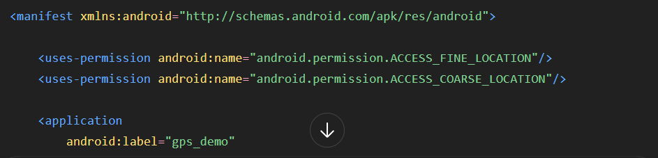

# flutter_gps_realtime_latlong

1. ทำแบบ flutter_gps ที่ไม่ใช้ Google Maps API ก่อน จะได้ไม่ต้องเสียค่า Google Maps
   โปรเจกต์นี้จะทำ:

    กด "เริ่ม GPS"
       ↓
    ขอสิทธิ์ Location
       ↓
    อ่าน GPS
       ↓
    Latitude
    Longitude
    Accuracy
       ↓
    อัปเดต Real-time ขณะเคลื่อนที่

2. สร้างโปรเจกต์ และติดตั้ง geolocator

    flutter pub add geolocator

3. ตั้งค่า Android Permission 
   - เปิดไฟล์ android/app/src/main/AndroidManifest.xml

4. เพิ่มบรรทัดนี้ ก่อน
   
   ไม่ต้องใส่ Google Maps API Key

5. แก้ main.dart
   - จุดสำคัญของโค้ด

```dart

   Geolocator.getPositionStream(
  locationSettings: const LocationSettings(
    accuracy: LocationAccuracy.high,
    distanceFilter: 5,
  ),
)

// distanceFilter: 5 หมายถึง เมื่อเคลื่อนที่ประมาณ 5 เมตรขึ้นไป จึงแจ้งตำแหน่งใหม่ ช่วยลดการใช้แบตเตอรี่และการประมวลผล

```


6. อธิบายโค้ด

```dart
Position? position; //Position เป็น class ของแพ็กเกจ geolocator ที่เก็บข้อมูลตำแหน่ง GPS 
                      // เช่น latitude, longitude, accuracy, speed, altitude, timestamp เป็นต้น
                      // เครื่องหมาย ? หมายถึง สามารถเป็น null ได้
                      // ตอนเปิดแอปใหม่: position = null 


  StreamSubscription<Position>? positionStream; // ตัวแปรสำหรับ Real-time เอาไว้เก็บ Subscription ของ GPS Stream
                                                // เมื่อ GPS เปลี่ยนตำแหน่ง Stream จะส่ง Position ใหม่เข้ามา

  bool isTracking = false; // ตัวแปร isTracking ใช้บอกว่า ตอนนี้กำลังติดตาม GPS อยู่หรือไม่

  String message = 'ยังไม่ได้เริ่ม GPS';

  Future<void> startGps() async {
    // ตรวจสอบว่าเปิด Location หรือยัง
    bool serviceEnabled =
        await Geolocator.isLocationServiceEnabled();

    if (!serviceEnabled) {
      setState(() {
        message = 'กรุณาเปิด Location ของมือถือ';
      });

      await Geolocator.openLocationSettings();
      return;
    }

    // ตรวจสอบ Permission
    LocationPermission permission =
        await Geolocator.checkPermission();

    if (permission == LocationPermission.denied) {
      permission =
          await Geolocator.requestPermission();

      if (permission == LocationPermission.denied) {
        setState(() {
          message = 'ผู้ใช้ไม่อนุญาต Location';
        });
        return;
      }
    }

    if (permission == LocationPermission.deniedForever) {
      setState(() {
        message =
            'Location ถูกปฏิเสธถาวร กรุณาเปิดใน Settings';
      });

      await Geolocator.openAppSettings();
      return;
    }

    // อ่านตำแหน่งครั้งแรก
    Position currentPosition =
        await Geolocator.getCurrentPosition();

    setState(() {
      position = currentPosition;
      isTracking = true;
      message = 'กำลังติดตามตำแหน่ง...';
    });

    // เริ่มติดตาม Real-time
    positionStream =
        Geolocator.getPositionStream(
      locationSettings: const LocationSettings(
        accuracy: LocationAccuracy.high,
        distanceFilter: 5,
      ),
    ).listen((Position newPosition) {
      setState(() {
        position = newPosition;
      });
    });
  }

  void stopGps() {
    positionStream?.cancel();
    positionStream = null;

    setState(() {
      isTracking = false;
      message = 'หยุด GPS แล้ว';
    });
  }

  @override
  void dispose() {
    positionStream?.cancel();
    super.dispose();
  }

  @override
  Widget build(BuildContext context) {
    return Scaffold(
      appBar: AppBar(
        title: const Text('GPS Demo'),
      ),
      body: Padding(
        padding: const EdgeInsets.all(20),
        child: Column(
          children: [

            Text(
              message,
              style: const TextStyle(
                fontSize: 18,
              ),
            ),

            const SizedBox(height: 30),

            Card(
              child: Padding(
                padding: const EdgeInsets.all(20),
                child: Column(
                  children: [

                    const Text(
                      'Latitude',
                      style: TextStyle(
                        fontSize: 16,
                        fontWeight: FontWeight.bold,
                      ),
                    ),

                    Text(
                      position == null
                          ? '-'
                          : position!.latitude
                              .toStringAsFixed(6),
                      style: const TextStyle(
                        fontSize: 25,
                      ),
                    ),

                    const SizedBox(height: 20),

                    const Text(
                      'Longitude',
                      style: TextStyle(
                        fontSize: 16,
                        fontWeight: FontWeight.bold,
                      ),
                    ),

                    Text(
                      position == null
                          ? '-'
                          : position!.longitude
                              .toStringAsFixed(6),
                      style: const TextStyle(
                        fontSize: 25,
                      ),
                    ),

                    const SizedBox(height: 20),

                    const Text(
                      'Accuracy',
                      style: TextStyle(
                        fontSize: 16,
                        fontWeight: FontWeight.bold,
                      ),
                    ),

                    Text(
                      position == null
                          ? '-'
                          : '${position!.accuracy.toStringAsFixed(1)} เมตร',
                      style: const TextStyle(
                        fontSize: 20,
                      ),
                    ),
                  ],
                ),
              ),
            ),

            const Spacer(),

            SizedBox(
              width: double.infinity,
              height: 55,
              child: ElevatedButton(
                onPressed:
                    isTracking ? stopGps : startGps,
                child: Text(
                  isTracking
                      ? 'หยุด GPS'
                      : 'เริ่ม GPS',
                  style: const TextStyle(
                    fontSize: 18,
                  ),
                ),
              ),
            ),
          ],
        ),
      ),
    );
  }

```


